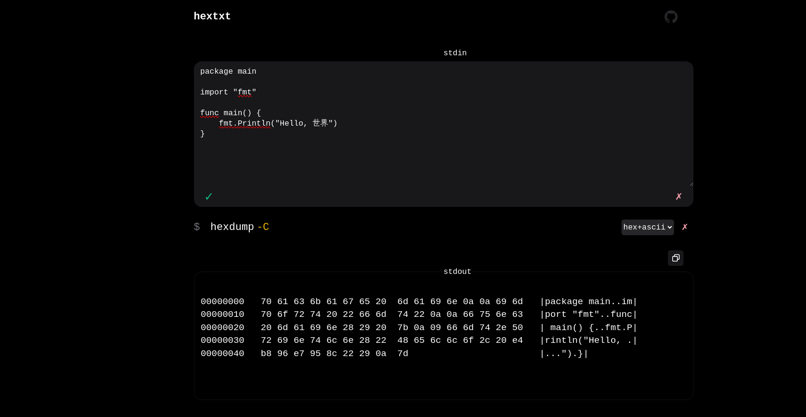

# hextxt



## Build

- First, compile Go code to WebAssembly:

  ```sh
  GOOS=js GOARCH=wasm go build -o main.wasm main.go
  ```

- Copy the WebAssembly JavaScript support file from local Go installation:

  ```sh
  cp "$(go env GOROOT)/misc/wasm/wasm_exec.js" .
  ```

- Final directory structure should look like:

  ```txt
  app/
  ├── index.html
  ├── main.wasm
  └── wasm_exec.js
  ```

- Push these files to GitHub/GitLab and enable Pages.

## Develop

```sh
find -name '*go' -or -name '*.html' | entr -crs "GOOS=js GOARCH=wasm go build -o main.wasm main.go; python -m http.server"
```

## Related

- <https://binspec.org/>
